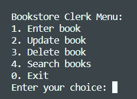
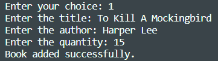
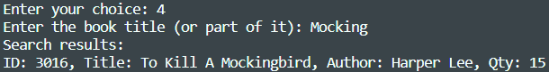
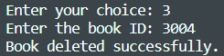

# Bookstore Inventory Management System

## Description
The Bookstore Inventory Management System is a command-line application designed to efficiently manage the inventory of a non/virtual bookstore. It provides functionalities to add, update, delete, and search for books within the bookstore's collection. The project aims to simplify inventory management tasks for bookstore clerks, making it easier to keep track of available books and their quantities.

## Importance
Managing inventory is crucial for any retail business, including online bookstores. This project addresses the need for an organized system to keep track of available books, update their quantities, and quickly retrieve book information. By automating these tasks, the application saves time and reduces human errors that could occur during manual bookkeeping.

## Table of Contents
- [Installation](#installation)
- [Usage](#usage)
- [Screenshots](#screenshots)

## Installation
To use the Ebookstore Inventory Management System locally, follow these steps:
1. Clone the repository to your local machine: `git clone https://github.com/MarnoShepherd/BookStoreInventory.git`
2. Navigate to the project directory: `cd BookStoreInventory`
3. Install the required dependencies (if any): `pip install sqlite3`
4. Run the main script: `python main.py`

## Usage
1. Upon running the script, the menu will be displayed, offering options for various actions.
2. Select an option by entering the corresponding number and follow the prompts:
   - To add a book, enter the title, author, and quantity.
   - To update a book's quantity, provide the book's ID and the new quantity.
   - To delete a book, enter the book's ID.
   - To search for books, enter a title or part of a title.

## Screenshots

This Bookstore Inventory Management System was developed to provide a user-friendly and efficient way to manage bookstore inventories. Whether you're a bookstore owner, clerk, or developer, this application simplifies inventory management tasks and contributes to a smoother operation. If you have any questions or suggestions, feel free to reach out to marnoshepherd19@gmail.com or github.com/MarnoShepherd.
